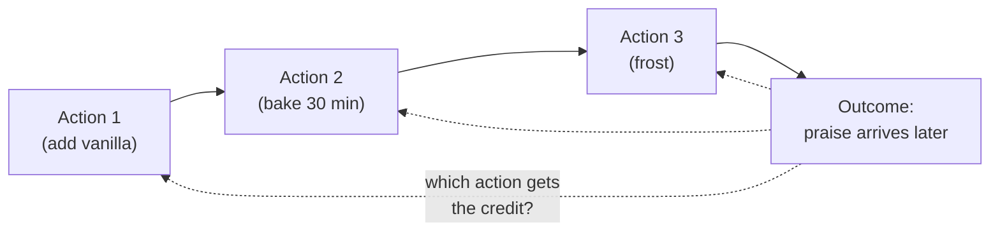
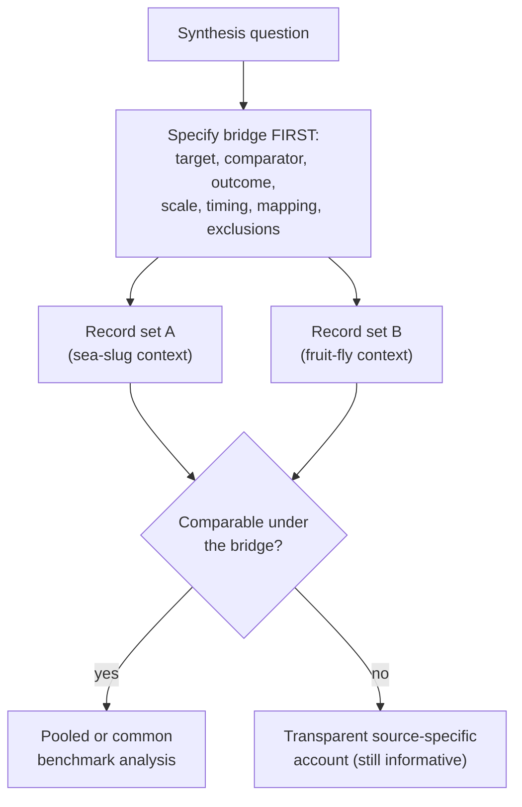
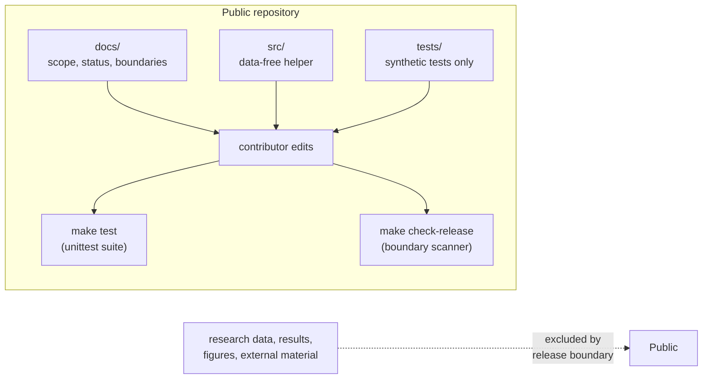

# Extended Introduction: A Gentle Tour of the Problem, the Organisms, and the Synthesis

This document is written for a reader with **no neuroscience background at all**. If you have ever baked a cake, you already understand the heart of this repository. We will build every idea from scratch, with analogies, and then show exactly how the code and documents in this project fit together. Where we cite scientific literature, we cite **only the references already listed in [docs/INTRODUCTION.md](INTRODUCTION.md)**, by author and year, so that every claim can be checked against the project's own record.

**Concept figure.** The central mechanism this repository examines — delayed outcomes updating earlier events through a fading memory trace — is drawn in [concept_figure.md](concept_figure.md) as an embedded Mermaid diagram. (The release boundary does not allow image files in the tracked tree, so the figure lives as text.) Part 1 below works through the same mechanism as explicit arithmetic.

## Part 1: What is temporal credit assignment?

Imagine you bake a cake for a party. You follow a long recipe: you cream the butter, sift the flour, add vanilla, bake for thirty minutes, and frost the cake an hour later. At the party, everyone says the cake is delicious. Now you want to know: **which step deserves the credit?** Was it the vanilla, added near the beginning? The exact baking time, in the middle? The frosting, at the end? The praise arrives *after* everything, yet it somehow has to be "sent back in time" to the one step that actually mattered.

That is the **credit assignment problem**: connecting a later outcome to the earlier action that caused it. Add one more wrinkle — the outcome arrives seconds, minutes, or hours after the action — and you have **temporal credit assignment**: figuring out which *earlier* event, among many separated in time, should be updated when a later reward or punishment finally arrives.

Brains face this constantly. An animal wanders through the world doing dozens of things; then something good or bad happens; and somehow the useful earlier behavior gets strengthened and the useless ones do not. One influential family of theories proposes an **eligibility trace**: the idea that recent neural activity leaves a temporary "sticky note" that can be written on when a later teaching signal arrives, like the recipe step leaving a mark that the eventual praise can highlight (Gerstner et al., 2018 — reference [1] in the introduction). This is a useful theory for linking fast neural events to later consequences, not a settled universal mechanism — a distinction this repository treats carefully.

**The trace, as arithmetic.** An eligibility trace sounds abstract, but it is one multiplication per time step. Suppose each event that occurs sets a synapse's sticky-note number to 1, and each step with no event multiplies the number by 0.5 (it fades by half). Now imagine three actions at steps 1, 2, and 3, and a reward of size 1 arriving at step 5, with the update rule "change in strength = trace × reward":

| Step | Event | Trace after the step | Update if reward arrives now |
|---|---|---|---|
| 1 | action A | 1.0 | 1.0 |
| 2 | action B (A's trace halves) | B: 1.0, A: 0.5 | — |
| 3 | action C (older traces halve) | C: 1.0, B: 0.5, A: 0.25 | — |
| 4 | (nothing) | C: 0.5, B: 0.25, A: 0.125 | — |
| 5 | reward arrives | traces unchanged | C gets 0.5, B gets 0.25, A gets 0.125 |

That is the entire mechanism: one halving per step, one multiplication at the end. The delayed praise automatically lands mostly on the frosting (recent) and barely on the vanilla (distant), with no clock-watching required — the fading numbers do the timekeeping. Everything called "eligibility" in the literature is a variation on this table: a different fade factor, a different update rule, or a trace carried by a synapse instead of a sticky note.

## Part 2: Why a sea slug and a fruit fly?

If you want to understand how a clock works, you do not start with a smartwatch. You start with a big, simple mechanical clock where you can see every gear. Biologists use the same strategy: they study **model organisms** — species chosen because they make a hard question easier to see.

### Aplysia: the sea slug with giant neurons

*Aplysia californica* is a large sea slug whose nervous system contains relatively few neurons, some of which are so large they can be seen without much magnification and identified from animal to animal. That is like a clock with a handful of huge, labeled gears instead of millions of microscopic ones. Researchers can find the *same neuron* in animal after animal, record from it, and watch how its connections change during learning. Work in this system has examined classical conditioning alongside activity-dependent changes at identified synapses (Antonov et al., 2001 — reference [2]), and *Aplysia* preparations have been central to the study of operant and associative learning, where an animal's own behavior is followed by a consequence (reviewed in Hawkins and Byrne, 2015 — reference [7]).

### Drosophila: the fruit fly with a genetic toolkit

*Drosophila melanogaster*, the common fruit fly, takes the opposite bet: not giant neurons, but a giant **toolkit**. More than a century of genetics gives researchers precise switches for specific groups of neurons — including the ability to activate defined cells with light. Work in this system has used light-addressable reinforcement circuitry to write memories (Claridge-Chang et al., 2009 — reference [8]), mapped the mushroom-body architecture that supports associative learning (Aso et al., 2014 — reference [9]), examined reinforcement signaling by dopamine neurons (Waddell, 2013 — reference [3]), and characterized learning-related plasticity (Hige et al., 2015 — reference [10]). If *Aplysia* is a clock with giant gears, *Drosophila* is a clock where you can label and flip every tiny gear individually.

### Why the pairing is tempting — and tricky

Together, the two organisms seem to cover the problem from both ends: one gives you visible, identified circuits; the other gives you genetic and optical control. So it is natural to ask: **does the evidence about temporal credit assignment in these two systems add up to one shared story?** That is the question this repository exists to examine — and, as we will see, the honest current answer is "we cannot tell yet," for reasons that are methodological rather than biological.

## Part 3: What is an evidence synthesis, and why "controlled"?

An **evidence synthesis** is the disciplined version of asking "so, what does the literature as a whole say?" It is *not* averaging numbers from several papers and hoping for the best. Suppose two chefs tell you how much vanilla their cakes used — but one measured in teaspoons of extract per cake and the other measured in drops of concentrate per batch, on different ovens, with different flours, and neither wrote down when the vanilla was added. You cannot fairly average those numbers. You first need a **common bridge**: an agreement, made *before* looking at anyone's results, about what is being compared, on what scale, measured when, and how each study's measure maps onto the shared benchmark.

Synthesis methodology makes this concrete. Cochrane guidance emphasizes pre-specified inclusion criteria and grouping of studies (reference [4]) and careful assessment of whether studies are similar enough for quantitative combination (reference [5]). When effect estimates cannot be pooled, structured alternatives exist, such as the SWiM reporting guideline for synthesis without meta-analysis (Campbell et al., 2020 — reference [11]) and Cochrane guidance on other synthesis methods (reference [13]). Reporting frameworks such as PRISMA 2020 (Page et al., 2021 — reference [12]) require a visible account of how records were searched, selected, and reported, and preclinical-synthesis literature stresses critical appraisal (Sena et al., 2014 — reference [6]) plus structured bias-assessment and reporting tools for animal studies (references [14] and [15]).

**Why "controlled" and reproducible?** Because a bridge chosen *after* seeing the results can quietly favor whichever measures happen to look compatible — like deciding what counts as "cake success" only after tasting. A controlled synthesis writes the comparison rules down first, so that anyone can check whether the conclusion came from the evidence or from the method. Reproducibility means a second person, given the same rules and the same records, would reach the same answer.

## Part 4: What this project actually did (and found)

This repository is the public, **data-free** staging tree of such a synthesis effort. Its honest status, recorded in [STATUS_AND_PLAN.md](STATUS_AND_PLAN.md) and [CURRENT_RESULTS_AND_DISCUSSION.md](CURRENT_RESULTS_AND_DISCUSSION.md), is:

- A **comparability assessment** was completed. The available source-specific records do not share a prospectively specified bridge, so they cannot justify a pooled effect, a common benchmark, a ranking, cross-system translation, or a shared-mechanism conclusion.
- The records differ in readiness: one re-analysis is *directionally suggestive but unstable*; one structural assessment is *inconclusive across reference families*; and one observational project contains *one bounded supportive encoding result alongside a separate non-supportive route*.
- The synthesis question is therefore **unresolved — not negative**. "We do not have a fair way to compare yet" is a different statement from "there is no relationship," and the project keeps that distinction explicit.
- A small **timing-contrast helper** (`src/p4_directional_timing_effect.py`) is retained as a pure arithmetic reference, tested only on invented numbers. It computes a difference of mean changes and is *not* an empirical effect estimate.

Everything in the public tree is governed by a strict [release boundary](RELEASE_BOUNDARY.md): documentation, deterministic data-free code, and synthetic tests are welcome; research data, results, figures, and external source material are excluded, and a scanner tool checks every tracked file.

## Part 5: The little bit of math actually used here

The repository deliberately uses very little mathematics, and every piece can be learned free online. One plain sentence each:

- **Arithmetic mean** — add up the values and divide by how many there are; the helper uses Python's `statistics.fmean` for this. (See Khan Academy's lessons on mean, or StatQuest's "Mean, Median, Mode" video.)
- **Difference of mean changes** — the helper computes `mean(post) - mean(pre)` for each of two conditions and subtracts one change from the other, answering "how much bigger was this group's average change than that group's?" (See Khan Academy on the mean of differences and StatQuest on interpreting differences of means.)
- **Finite-value validation** — before averaging, the helper checks that inputs are non-empty, numeric, and finite (no NaN or infinity), so the arithmetic can never silently produce a meaningless number. (See Seeing Theory's interactive chapters on basic probability and descriptive statistics for intuition.)
- **Distributions and inference (background for the methods doc)** — choosing statistical tests later depends on whether data roughly follow a bell-shaped distribution; 3Blue1Brown's visual explainer on the central limit theorem and Seeing Theory's sampling-distribution chapter are the friendliest starting points.

That is the whole quantitative core: means, differences of means, and validation. No calculus, no linear algebra, no machine learning.

## Part 6: Where to go next

- New to the science? You are done — the rest of the docs assume only what you just read.
- Ready to contribute? Read [METHODS.md](METHODS.md) next: it explains what is finished, what is intended, and the hygiene rules (synthetic ground truth, null checks, test discipline) that keep this project honest.
- Curious about the exact limits? See [CURRENT_RESULTS_AND_DISCUSSION.md](CURRENT_RESULTS_AND_DISCUSSION.md), [METHODS_SCOPE.md](METHODS_SCOPE.md), and [RELEASE_BOUNDARY.md](RELEASE_BOUNDARY.md).

## References

All literature citations above refer to the numbered reference list in [docs/INTRODUCTION.md](INTRODUCTION.md), which is the repository's single citable source list. The key entries used here are: Gerstner et al. 2018 [1]; Antonov et al. 2001 [2]; Waddell 2013 [3]; Cochrane Handbook chapters 3, 10, and 12 [4, 5, 13]; Sena et al. 2014 [6]; Hawkins and Byrne 2015 [7]; Claridge-Chang et al. 2009 [8]; Aso et al. 2014 [9]; Hige et al. 2015 [10]; Campbell et al. 2020 (SWiM) [11]; Page et al. 2021 (PRISMA) [12]; SYRCLE [14]; and ARRIVE 2.0 [15]. No citations beyond that list are made in this document.
