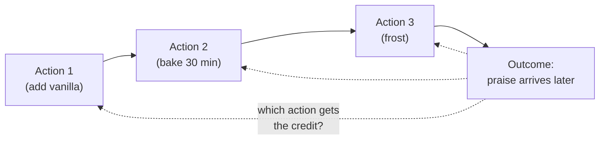
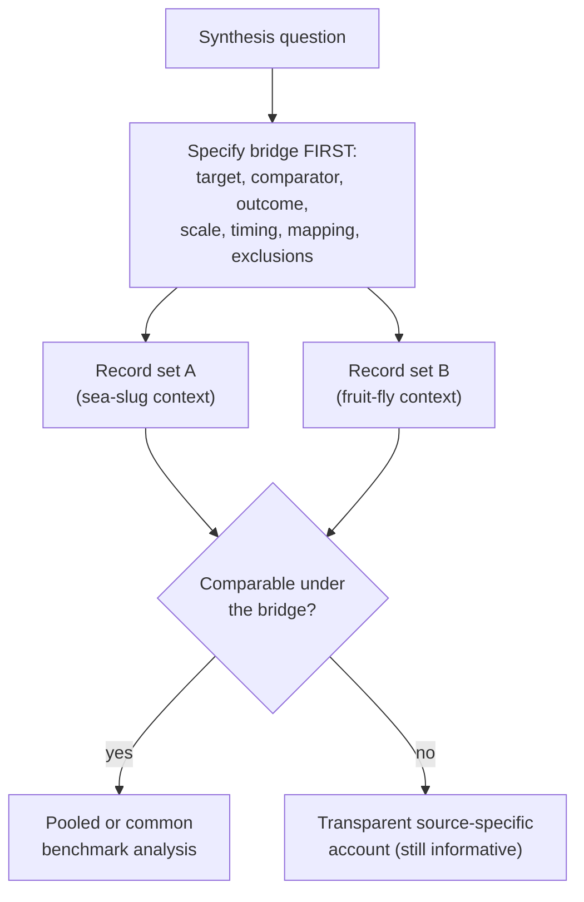
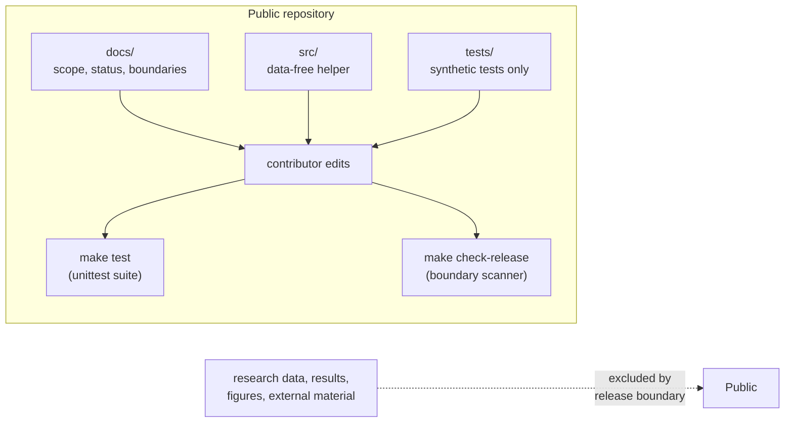

# Extended Introduction: A Gentle Tour of the Problem, the Organisms, and the Synthesis

This document is written for a reader with **no neuroscience background at all**. If you have ever baked a cake, you already understand the heart of this repository. We will build every idea from scratch, with analogies, and then show exactly how the code and documents in this project fit together. Where we point to scientific literature, we point **only to the numbered reference list in [docs/INTRODUCTION.md](INTRODUCTION.md)**, by number, so that every claim can be checked against the project's own record.

There is also no single correct mental model for the core ideas. So after each core concept you will find a **"many roads"** subsection: several independent mathematical lenses on the same idea, each with a tiny fully-worked example using small integers. Read whichever road matches how you think and skip the rest — they all arrive at the same place. None of them need calculus, differential equations, or any physics.

## Part 1: What is temporal credit assignment?

Imagine you bake a cake for a party. You follow a long recipe: you cream the butter, sift the flour, add vanilla, bake for thirty minutes, and frost the cake an hour later. At the party, everyone says the cake is delicious. Now you want to know: **which step deserves the credit?** Was it the vanilla, added near the beginning? The exact baking time, in the middle? The frosting, at the end? The praise arrives *after* everything, yet it somehow has to be "sent back in time" to the one step that actually mattered.

That is the **credit assignment problem**: connecting a later outcome to the earlier action that caused it. Add one more wrinkle — the outcome arrives seconds, minutes, or hours after the action — and you have **temporal credit assignment**: figuring out which *earlier* event, among many separated in time, should be updated when a later reward or punishment finally arrives.

Brains face this constantly. An animal wanders through the world doing dozens of things; then something good or bad happens; and somehow the useful earlier behavior gets strengthened and the useless ones do not. One influential family of theories proposes an **eligibility trace**: the idea that recent neural activity leaves a temporary "sticky note" that can be written on when a later teaching signal arrives, like the recipe step leaving a mark that the eventual praise can highlight (reference [1] in the introduction). This is a useful theory for linking fast neural events to later consequences, not a settled universal mechanism — a distinction this repository treats carefully.

### The many roads to temporal credit assignment

**Road 1: graph theory.** Draw the episode as a directed graph: nodes are events (actions, outcome), and an edge X → Y means "X is a candidate cause of Y." Credit assignment is then the problem of assigning weights to the edges that end at the outcome node. Worked example with 4 nodes: vanilla (V), baking (B), frosting (F), praise (P), with edges V→P, B→P, F→P. If you walk the graph backwards from P, you visit 3 candidate parents; the credit problem is exactly that the graph alone cannot tell you which edge carried the effect — you need extra evidence (say, a repeat episode where the frosting was skipped and praise still arrived, which removes the F→P edge from suspicion). *What this buys you:* the structure of the problem — how many candidates, what evidence would prune which edge — with no numbers at all. *What it costs you:* the graph says nothing about how much credit each surviving edge deserves.

**Road 2: probability as frequencies.** Count co-occurrences. Suppose you bake 100 cakes: vanilla added or not (rows), praised or not (columns), and the tally comes out (vanilla, praised): 40; (vanilla, not): 10; (no vanilla, praised): 12; (no vanilla, not): 38. With vanilla, praise follows in 40 of 50 cases; without it, only 12 of 50. The gap between 0.8 and 0.24 is the entire empirical content of "the vanilla caused the praise." Temporal credit assignment adds only one extra column: *how long before the outcome* each candidate event happened. *What this buys you:* every claim is a recount of a table anyone can audit. *What it costs you:* the table explodes when there are many candidate events or continuous outcomes, and it cannot see causes that never vary in your sample.

**Road 3: information theory by counting.** Ask how many yes/no questions the outcome answers about the past. With 8 candidate recipe steps and no other knowledge, identifying the responsible step needs log2(8) = 3 questions. If the outcome ("delicious") rules out 6 of the 8 steps, it answered log2(8) − log2(2) = 3 − 1 = 2 questions, leaving 1 question (2 candidates) of residual doubt. That residue *is* the unresolved credit. *What this buys you:* a countable measure of how much a single outcome can ever teach — one outcome answers a bounded number of questions, so credit among many steps stays partly ambiguous. *What it costs you:* it measures ambiguity removed, not mechanism identified.

**Road 4: game theory as blame allocation.** Treat each recipe step as a player in a coalition game whose prize is the praise; fair credit is whatever split no coalition of steps can object to. Worked example: steps V and F alone each earn 0 praise, but V and F together earn 6. A fair split gives V credit 3 and F credit 3 — each step's share equals what it adds to the coalition (adding V to {F} changes the prize from 0 to 6, and symmetrically for F). If V alone earns 4 and the pair earns 6, the split shifts: V contributed 4 on its own and 2 by joining F, F contributed only 2, so V deserves more. *What this buys you:* a principled, symmetric notion of "fair share" that handles interacting steps. *What it costs you:* computing shares means enumerating coalitions, which grows explosively (8 steps have 256 coalitions), and fairness is not the same as biological mechanism.

### The many roads to the eligibility trace

**Road 1: discrete iterated maps.** The trace is one rule: tomorrow's mark = decay × today's mark + today's activity. Pick decay 0.5. A step active at time 0 with strength 4 leaves marks: 4, 2, 1, 0.5 — each step multiplies by 0.5, and three steps later a quarter of the mark remains. If a reward arrives at time 3, it finds the mark at 0.5, and the update to that step is proportional to 0.5 — that is the whole mechanism, one multiplication per row of a table. *What this buys you:* the complete dynamics as iterated arithmetic; "how long does memory last" becomes "how many rows until the mark is negligible" (here, about 4 rows to reach 0.25). *What it costs you:* you see the trace only at discrete steps; a trace that fades between steps is invisible to the table.

**Road 2: automata and computation.** A synapse with an eligibility trace is a finite-state machine with one memory slot holding the current mark. Its transition table has two kinds of events: "activity happened" (add to the slot) and "teaching signal arrived" (read the slot, change the synapse, optionally clear the slot). Worked example, slot starts at 0: activity of strength 2 arrives (slot: 0 → 2), one quiet step passes with decay 0.5 (slot: 2 → 1), a teaching signal of strength 3 arrives (update = 3 × 1 = 3). Three table lookups, one addition, two multiplications — the machine is the whole theory. *What this buys you:* a direct bridge to code and to the idea that "memory" can be a single number in a slot. *What it costs you:* the table hides continuity, and a real synapse may carry more than one slot's worth of state.

**Road 3: statistical mechanics by counting.** Why does recency dominate credit? Because recent events have *more chances* to still be marked when the outcome lands. Count the ways: if a mark survives each step with probability one-half, then an event 1 step old survives in 1 of 2 worlds, an event 2 steps old in 1 of 4, an event 3 steps old in 1 of 8. Across many repetitions, the tally of "still marked at outcome time" is 4 : 2 : 1 for ages 1, 2, 3 — recency advantage is a multiplicity count, not a force pulling toward the present. *What this buys you:* an interpretation of decay as population statistics over repeated trials. *What it costs you:* it is silent about any single trial, where an old mark may happen to survive.

## Part 2: Why a sea slug and a fruit fly?

If you want to understand how a clock works, you do not start with a smartwatch. You start with a big, simple mechanical clock where you can see every gear. Biologists use the same strategy: they study **model organisms** — species chosen because they make a hard question easier to see.

### Aplysia: the sea slug with giant neurons

*Aplysia californica* is a large sea slug whose nervous system contains relatively few neurons, some of which are so large they can be seen without much magnification and identified from animal to animal. That is like a clock with a handful of huge, labeled gears instead of millions of microscopic ones. Researchers can find the *same neuron* in animal after animal, record from it, and watch how its connections change during learning. Work in this system has examined classical conditioning alongside activity-dependent changes at identified synapses (reference [2]), and *Aplysia* preparations have been central to the study of operant and associative learning, where an animal's own behavior is followed by a consequence (reviewed in reference [7]).

### Drosophila: the fruit fly with a genetic toolkit

*Drosophila melanogaster*, the common fruit fly, takes the opposite bet: not giant neurons, but a giant **toolkit**. More than a century of genetics gives researchers precise switches for specific groups of neurons — including the ability to activate defined cells with light. Work in this system has used light-addressable reinforcement circuitry to write memories (reference [8]), mapped the mushroom-body architecture that supports associative learning (reference [9]), examined reinforcement signaling by dopamine neurons (reference [3]), and characterized learning-related plasticity (reference [10]). If *Aplysia* is a clock with giant gears, *Drosophila* is a clock where you can label and flip every tiny gear individually.

### Why the pairing is tempting — and tricky

Together, the two organisms seem to cover the problem from both ends: one gives you visible, identified circuits; the other gives you genetic and optical control. So it is natural to ask: **does the evidence about temporal credit assignment in these two systems add up to one shared story?** That is the question this repository exists to examine — and, as we will see, the honest current answer is "we cannot tell yet," for reasons that are methodological rather than biological.

## Part 3: What is an evidence synthesis, and why "controlled"?

An **evidence synthesis** is the disciplined version of asking "so, what does the literature as a whole say?" It is *not* averaging numbers from several papers and hoping for the best. Suppose two chefs tell you how much vanilla their cakes used — but one measured in teaspoons of extract per cake and the other measured in drops of concentrate per batch, on different ovens, with different flours, and neither wrote down when the vanilla was added. You cannot fairly average those numbers. You first need a **common bridge**: an agreement, made *before* looking at anyone's results, about what is being compared, on what scale, measured when, and how each study's measure maps onto the shared benchmark.

Synthesis methodology makes this concrete. Handbook guidance emphasizes pre-specified inclusion criteria and grouping of studies (reference [4]) and careful assessment of whether studies are similar enough for quantitative combination (reference [5]). When effect estimates cannot be pooled, structured alternatives exist, such as the reporting guideline for synthesis without meta-analysis (reference [11]) and handbook guidance on other synthesis methods (reference [13]). A major reporting framework for systematic reviews (reference [12]) requires a visible account of how records were searched, selected, and reported, and preclinical-synthesis literature stresses critical appraisal (reference [6]) plus structured bias-assessment and reporting tools for animal studies (references [14] and [15]).

**Why "controlled" and reproducible?** Because a bridge chosen *after* seeing the results can quietly favor whichever measures happen to look compatible — like deciding what counts as "cake success" only after tasting. A controlled synthesis writes the comparison rules down first, so that anyone can check whether the conclusion came from the evidence or from the method. Reproducibility means a second person, given the same rules and the same records, would reach the same answer.

### The many roads to a bridge (comparability)

**Road 1: set theory.** Each study's measurement is a set of situations in which its number means something definite: study A measures {teaspoons per cake, home oven, wheat flour}, study B measures {drops per batch, commercial oven, rye flour}. A bridge exists only if the **intersection** of these sets is non-empty — some shared situation where both numbers are defined. Worked example: A's scale is defined for {cakes 1–50 g sugar}, B's scale for {cakes 40–80 g sugar}; the intersection is {40–50 g}, non-empty, so a bridge restricted to that band exists; if A were {1–30} and B {40–80}, the intersection is empty and *no* honest bridge exists. The project's comparability assessment is exactly this membership test, done with care. *What this buys you:* a binary, auditable verdict — comparable here, not there. *What it costs you:* sets are silent about *how good* the comparison is inside the intersection.

**Road 2: category-flavored composition.** Think of each study's scale as an object and a unit-conversion as an arrow between objects. A bridge is a pair of arrows (A → common, B → common) such that comparing after mapping gives the same answer by either road — a diagram that "commutes." Worked example: convert teaspoons to drops (1 teaspoon = 60 drops, so 2 teaspoons → 120 drops) and also convert each to grams of vanilla (120 drops ≈ 5 g); if the two roads from "2 teaspoons" both land on "5 g," the diagram commutes and the bridge is sound. If one road lands on 5 g and the other on 9 g, the arrows disagree and no amount of averaging fixes it. *What this buys you:* a precise meaning of "the conversions are consistent with each other." *What it costs you:* the lens checks internal consistency, not whether the common unit (grams of vanilla) is biologically meaningful.

**Road 3: game theory, the adversarial bridge-chooser.** Model the risk of post-hoc bridging as a game against an adversary who picks the bridge *after* seeing all results, trying to maximize the apparent agreement. Worked example with two candidate bridges: under bridge 1 the studies' scores are 0.4 and 0.6 (gap 0.2); under bridge 2 they are 0.45 and 0.5 (gap 0.05). The adversary picks bridge 2 and reports "excellent agreement." Pre-specification removes the adversary's move: the bridge is fixed before results arrive, so the gap you report is the gap there is. *What this buys you:* a crisp explanation of *why* ordering (rules first, results second) is a safeguard rather than a formality. *What it costs you:* real researchers are not adversaries, but the model shows that even honest, flexible choices can mimic one.

**Road 4: automata and computation.** A controlled synthesis protocol is a finite-state machine: states are stages (question stated → bridge fixed → records screened → records grouped → verdict), and the transition rules forbid edges that skip or reorder stages (no arrow from "records screened" back to "bridge fixed"). Worked example: a 5-state machine whose only allowed edges are 1→2→3→4→5 plus the terminal edge 5→done; any attempt to revise the bridge at stage 4 has no legal transition, so the machine halts with an error instead of silently continuing. Reproducibility is then a property of the machine: the same input records drive it to the same final state. *What this buys you:* protocol discipline as something mechanically checkable. *What it costs you:* the machine enforces order, not the wisdom of the bridge itself.

## Part 4: What this project actually did (and found)

This repository is the public, **data-free** staging tree of such a synthesis effort. Its honest status, recorded in [STATUS_AND_PLAN.md](STATUS_AND_PLAN.md) and [CURRENT_RESULTS_AND_DISCUSSION.md](CURRENT_RESULTS_AND_DISCUSSION.md), is:

- A **comparability assessment** was completed. The available source-specific records do not share a prospectively specified bridge, so they cannot justify a pooled effect, a common benchmark, a ranking, cross-system translation, or a shared-mechanism conclusion.
- The records differ in readiness: one re-analysis is *directionally suggestive but unstable*; one structural assessment is *inconclusive across reference families*; and one observational project contains *one bounded supportive encoding result alongside a separate non-supportive route*.
- The synthesis question is therefore **unresolved — not negative**. "We do not have a fair way to compare yet" is a different statement from "there is no relationship," and the project keeps that distinction explicit.
- A small **timing-contrast helper** (`src/p4_directional_timing_effect.py`) is retained as a pure arithmetic reference, tested only on invented numbers. It computes a difference of mean changes and is *not* an empirical effect estimate.

Everything in the public tree is governed by a strict [release boundary](RELEASE_BOUNDARY.md): documentation, deterministic data-free code, and synthetic tests are welcome; research data, results, figures, and external source material are excluded, and a scanner tool checks every tracked file.

## Part 5: The little bit of math actually used here

The repository deliberately uses very little mathematics, and every piece can be learned free online. One plain sentence each:

- **Arithmetic mean** — add up the values and divide by how many there are; the helper uses Python's `statistics.fmean` for this. (See Khan Academy's lessons on mean, or StatQuest's "Mean, Median, Mode" video.)
- **Difference of mean changes** — the helper computes `mean(post) - mean(pre)` for each of two conditions and subtracts one change from the other, answering "how much bigger was this group's average change than that group's?" (See Khan Academy on the mean of differences and StatQuest on interpreting differences of means.)
- **Finite-value validation** — before averaging, the helper checks that inputs are non-empty, numeric, and finite (no NaN or infinity), so the arithmetic can never silently produce a meaningless number. (See Seeing Theory's interactive chapters on basic probability and descriptive statistics for intuition.)
- **Distributions and inference (background for the methods doc)** — choosing statistical tests later depends on whether data roughly follow a bell-shaped distribution; 3Blue1Brown's visual explainer on the central limit theorem and Seeing Theory's sampling-distribution chapter are the friendliest starting points.

That is the whole quantitative core: means, differences of means, and validation. No calculus, no linear algebra, no machine learning.

### The many roads to "difference of mean changes"

**Road 1: geometry.** Each condition's pre- and post-scores are two points on a number line; a change is the arrow between them, and the helper compares the *lengths* of two arrows. Worked example: condition A moves from 2 to 6 (arrow length 6 − 2 = 4); condition B moves from 3 to 4 (length 1). The contrast is 4 − 1 = 3: A's arrow is 3 units longer. "Directionally suggestive" means the arrows point the same way but their lengths wobble across samples. *What this buys you:* a picture in which "bigger change" is literally a longer arrow. *What it costs you:* arrow length ignores how spread out the underlying points were — a long arrow through a fog of points is less convincing than the same arrow through a tight cluster.

**Road 2: linear algebra as weight tables.** A mean is a weighted sum with equal weights: the mean of 3 values is the table row (1/3, 1/3, 1/3) applied to the values. A difference of means is two such rows subtracted, so the whole helper is a tiny weight table with entries like +1/3 and −1/3. Worked example: pre = (1, 2, 3), post = (3, 4, 5); mean(post) − mean(pre) = (3+4+5)/3 − (1+2+3)/3 = 4 − 2 = 2, equivalently the single weight row (−1/3, −1/3, −1/3, +1/3, +1/3, +1/3) on the concatenated list. *What this buys you:* the computation as one inspectable table; you can check every weight by hand. *What it costs you:* equal weights are a choice — the table cannot warn you that some values deserved more weight.

**Road 3: probability as frequencies.** Read the mean as the balance point of a tally. If condition A's changes are {2, 4, 6}, the tally says "one 2, one 4, one 6," and the balance point is (2+4+6)/3 = 4; condition B's changes {0, 1, 2} balance at 1; the contrast is 3. Now ask the frequency question: in how many shuffles of the six values into two groups of three would the contrast be at least 3? You can enumerate them by hand — there are 20 ways to split six items into two labeled groups of three — and count how many reach 3. That counting exercise is the entire logic behind the statistical tests the methods doc defers. *What this buys you:* "how surprising is this contrast" becomes an enumeration you can finish on one page. *What it costs you:* with real sample sizes the enumeration is huge, which is why software exists.

## Part 6: Where to go next

- New to the science? You are done — the rest of the docs assume only what you just read.
- Ready to contribute? Read [METHODS.md](METHODS.md) next: it explains what is finished, what is intended, and the hygiene rules (synthetic ground truth, null checks, test discipline) that keep this project honest.
- Curious about the exact limits? See [CURRENT_RESULTS_AND_DISCUSSION.md](CURRENT_RESULTS_AND_DISCUSSION.md), [METHODS_SCOPE.md](METHODS_SCOPE.md), and [RELEASE_BOUNDARY.md](RELEASE_BOUNDARY.md).

## References

All literature pointers above refer to the numbered reference list in [docs/INTRODUCTION.md](INTRODUCTION.md), which is the repository's single citable source list. The entries used here are [1] (eligibility traces), [2] (conditioning at identified sea-slug synapses), [3] (reinforcement signaling in the fruit fly), [4, 5, 13] (evidence-synthesis handbook chapters), [6] (critical appraisal of preclinical syntheses), [7] (a review of invertebrate associative learning), [8] (light-addressable reinforcement circuitry), [9] (mushroom-body architecture), [10] (learning-related plasticity in the fly), [11] (synthesis without meta-analysis), [12] (systematic-review reporting framework), and [14, 15] (animal-study bias-assessment and reporting tools). No citations beyond that list are made in this document.

## Choosing your road

If you think in connections and structure, take **graph theory** — credit assignment is weighing edges that point at the outcome. If you think in tallies and recounts, take **probability as frequencies** — evidence is a table you can audit cell by cell. If you think in questions and answers, take **information theory** — an outcome answers a bounded number of questions about the past. If you think in fair shares and coalitions, take **game theory** — credit is a split no coalition can object to, and pre-specification disarms an adversarial bridge-chooser. If you think in step-by-step rules, take **discrete iterated maps** — an eligibility trace is one multiplication per row. If you think in states and transitions, take **automata** — a protocol is a machine with forbidden edges. If you think in membership and overlap, take **set theory** — a bridge is a non-empty intersection. If you think in consistent conversions, take the **category-flavored** road — a sound bridge is a diagram whose two roads agree. If you think in pictures, take **geometry** — an effect is the length of an arrow.
