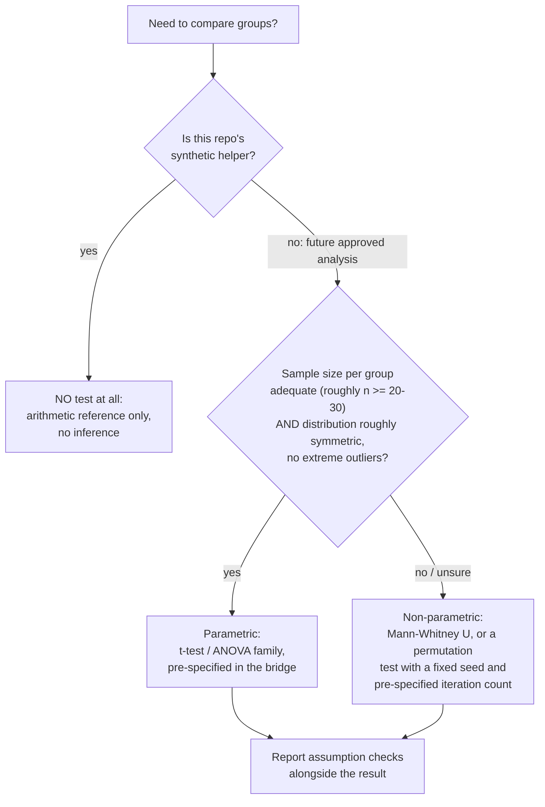

# Methods: What Is Done, What Is Intended, and How We Keep It Honest

This document is for **new contributors who are new to data science**. It explains what this repository already does, what it deliberately does not do yet, why the design looks the way it does, and the hygiene rules that apply to any future analysis. It complements [METHODS_SCOPE.md](METHODS_SCOPE.md), which defines the conceptual scope; this file focuses on engineering and analysis practice.

## Done

These items are implemented, tested, and verifiable from the public tree today.

1. **A deterministic, data-free timing-contrast helper** (`src/p4_directional_timing_effect.py`). The function `within_source_directional_timing_effect` takes four caller-supplied numeric sequences — a "before" and "after" for one condition, and the same for a comparison condition — and returns

   ```text
   mean(contingent_post) - mean(contingent_pre) - (mean(control_post) - mean(control_pre))
   ```

   It uses only the Python standard library (`statistics.fmean`, `math.isfinite`), reads no files, touches no network, and always returns the same output for the same input. Its private helper `_finite_mean` rejects empty sequences, non-numeric values, and non-finite values (NaN, infinity) by raising `ValueError` with a label naming the offending input.

2. **A synthetic-only test suite** (`tests/test_p4_directional_timing_effect.py`). Four standard-library `unittest` cases check: a negative arithmetic direction, exact cancellation when both conditions change equally, a positive direction, and rejection of empty or non-finite inputs. All values are invented in memory; no test creates or reads files. The suite runs with `python3 -B -m unittest discover -s tests -v` (or `make test`).

3. **A release-boundary scanner** (`tools/check_release_boundary.py`, run via `make check-release`). This dependency-free script lists Git-tracked paths with `git ls-files`, rejects prohibited directory names and file types, and scans tracked text for clear boundary markers (external URLs, DOI-like identifiers, email-like text). It reads tracked content only, never walks data directories, never uses the network, and writes nothing. It is a guardrail, not a substitute for human review.

4. **A completed comparability assessment** (recorded in [STATUS_AND_PLAN.md](STATUS_AND_PLAN.md)). The available source-specific records were reviewed for a prospectively specified common bridge; none exists. Their qualitative readiness states — one directionally suggestive but unstable record, one record inconclusive across reference families, and one record with a bounded supportive route plus a non-supportive route — are preserved as source-specific statements, not merged into a score.

5. **A documentation set with an explicit claim boundary**. The docs consistently state that the synthesis is **unresolved, not negative**, and that no pooled effect, common benchmark, ranking, cross-system translation, or shared-mechanism conclusion is supported.

## Intended

These items are planned or gated; none is authorized for execution in the public tree yet.

1. **A prospective bridge specification** (gated; see the open planning issues in the repository tracker). Before any candidate record is inspected, a written bridge must fix the target, comparator, outcome, measurement scale, timing convention, mapping rule, and exclusion rule. Approval by the named scientific owner must precede any selection, screening, or analysis, and any approved work happens outside this public repository under a separate data boundary.
2. **Alternative-bridge safeguards** (gated). Reasonable alternative bridge choices and a qualitative decision rule would be fixed in advance, evaluated separately, and any instability reported rather than resolved by choosing the most favorable framing.
3. **Continued data-free maintenance** (open to contributors now): documentation clarity reviews, synthetic-test extensions, and docstring contracts — several small, ready tasks are listed in the issue tracker.

## Design decisions, and why

- **Pure standard library, no dependencies.** The helper and scanner import only `math`, `statistics`, `subprocess`, `sys`, and `pathlib`. *Why:* a dependency-free tree can be run anywhere by anyone, and there is no version drift to reproduce.
- **Determinism by construction.** No randomness, no clocks, no environment reads in the analysis code. *Why:* deterministic code makes "same input, same output" a testable property, which is the cheapest form of reproducibility.
- **Validation before arithmetic.** Every sequence is checked (non-empty, numeric, finite) before means are computed, and errors name the offending input. *Why:* silent propagation of NaN or empty means is the most common way small utilities produce quietly wrong results; failing loudly at the boundary keeps debugging local.
- **Difference-of-means formula, nothing more.** The helper intentionally performs no inference — no p-values, no confidence intervals, no effect-size heuristics. *Why:* within this repository the formula is an *arithmetic reference*, and its sign has no biological interpretation (see [METHODS_SCOPE.md](METHODS_SCOPE.md)); adding inference would invite reading synthetic arithmetic as evidence.
- **Synthetic ground truth in tests.** Each test constructs invented numbers whose expected result is known by hand (for example, matched changes must cancel to exactly zero). *Why:* when you know the right answer in advance, a passing test actually demonstrates correct behavior rather than merely the absence of crashes.
- **Boundary scanner as code.** The release policy is enforced by an automated tracked-file check in addition to human review. *Why:* policies that live only in prose get forgotten; a guardrail in the Makefile runs every time.
- **Google-style docstrings** (summary plus `Args`, `Returns`, `Raises`) on public callables. *Why:* the contract of a function should be readable without reading its body.

### Undecided items, with both options and a selection rule

1. **Timing convention for a future bridge.** Option A: align all records to a common event-relative time origin (simple, but can distort systems whose native sampling differs). Option B: keep each record on its native clock and map only qualitative orderings (safer against distortion, but blocks any numeric pooling). *Selection rule:* decide in the prospective bridge specification, before any record is inspected; choose B unless the bridge author can state, in writing, why A preserves each record's original meaning.
2. **Granularity of the common benchmark.** Option A: a binary "supports / does not support the bridge" classification per record. Option B: an ordinal readiness scale (as used qualitatively in the current docs). *Selection rule:* default to the coarsest option (binary) that still answers the bridge question; adopt a finer scale only if reviewers can show pre-specified, repeatable boundaries between levels.
3. **Handling non-comparable records.** Option A: exclude them silently. Option B: retain and report them explicitly as non-comparable. *Selection rule:* always B — the current discussion document already requires recording exclusions rather than revising the bridge to accommodate them after review.

## Parametric vs non-parametric: a decision guide

The current helper does **no** statistical testing, so this guide applies to *future, separately approved* analyses — and to reading other people's code. A **parametric** test (for example, a t-test) assumes the data roughly follow a specific shape, typically a bell-shaped normal distribution; it is more powerful when the assumption holds and misleading when it does not. A **non-parametric** test (for example, a Mann-Whitney U test or a permutation test) makes weaker shape assumptions at some cost in power.



Concrete rules for this repository's context:

- **Inside this public tree:** never run a statistical test; the helper's output is arithmetic only, and its sign has no biological meaning.
- **Small samples or skewed data:** prefer non-parametric; tiny samples make normality unverifiable, so the weaker-assumption route is the honest default.
- **Adequate samples with approximately symmetric, outlier-free data:** a parametric test is acceptable if, and only if, it was named in the pre-specified bridge.
- **Ties between options:** when both are defensible, the selection rule is to pick the test named in the prospective bridge; if the bridge is silent, that is a defect in the bridge, not a license to try both and report the better one.

## Hygiene rules

- **Seeds.** No code in the current tree uses randomness, which is the strongest reproducibility guarantee available. If a future, separately bounded analysis ever needs randomness (for example, permutation tests), it must use a fixed, documented seed recorded alongside the code — never a default or time-derived seed.
- **Synthetic ground truth.** Every test must use invented values with a hand-known answer (the cancellation-to-zero test is the model example). A test that merely checks "runs without error" is not accepted as evidence of correctness.
- **Null models.** Any future comparison should include a null check: an input pattern for which the correct result is *no effect* (the existing matched-change test is exactly this idea). If a method "finds" an effect on null-pattern input, the method is wrong regardless of how plausible the output looks.
- **Test discipline.** Run `make test` and `make check-release` before sharing any change. Tests stay synthetic, create no files, and use only the standard library; new validation cases should extend existing test methods rather than duplicate them.
- **Reproducible evidence synthesis.** Following the reporting guidance cited in [INTRODUCTION.md](INTRODUCTION.md) (PRISMA 2020 [12], SWiM [11], Cochrane chapters [4, 5, 13], plus SYRCLE [14] and ARRIVE 2.0 [15] for animal-study appraisal), any future synthesis must document its search and inclusion criteria *prospectively*: the bridge fixes target, comparator, outcome, scale, timing, mapping, and exclusions before records are inspected, and non-comparable records are reported rather than absorbed.
- **Separation of materials.** Synthetic validation, empirical evidence, and interpretation live in clearly separate materials; the arithmetic helper must never be cited as evidence for a biological mechanism.

## Quick checklist for contributors

1. Is my change data-free (no research data, results, figures, or external source material)?
2. Does it pass `make test` and `make check-release` locally?
3. If it adds code, is it deterministic, standard-library only, and documented with Google-style docstrings?
4. If it adds tests, are they synthetic with a hand-known expected answer?
5. Does my wording preserve the boundary: unresolved is not negative, and synthetic arithmetic is not empirical evidence?
