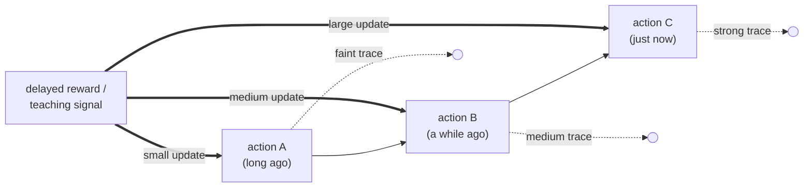

# Concept Figure: Temporal Credit Assignment with an Eligibility Trace

This file is the tracked, text-only stand-in for the repository's concept
figure. The public release boundary does not permit image files or figure
directories in the tracked tree (see `tools/check_release_boundary.py` and
[RELEASE_BOUNDARY.md](RELEASE_BOUNDARY.md)), so the figure is expressed here
as a Mermaid diagram that any Markdown viewer with Mermaid support renders
automatically.

**Caption:** Temporal credit assignment. Actions happen one after another;
each leaves a fading temporary record (an eligibility trace, shown as dotted
trails). When a delayed reward or teaching signal finally arrives, it reaches
backward and updates earlier events in proportion to how much trace remains:
the recent action is updated strongly, the distant one barely.

Reading the diagram:

1. Time runs left to right; three actions occur in sequence.
2. Each action leaves a **trace** that decays — a bookkeeping device, nothing
   more mysterious than a number that is multiplied by a fixed fraction each
   step (the worked arithmetic is in
   [EXTENDED_INTRODUCTION.md](EXTENDED_INTRODUCTION.md), Part 1).
3. When the outcome arrives late, the update to each past action is
   proportional to the trace that is still left — so the outcome
   automatically lands mostly on recent events.
4. The open scientific question this repository tracks is whether the
   *invertebrate* evidence for such mechanisms can be compared across
   species under one prospectively specified bridge — not whether the
   diagram looks plausible.
